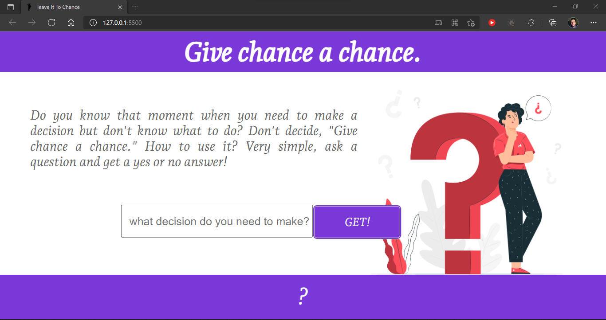

# Give chance a chance.
> Leave it to chance

Do you know that moment when you need to make a decision but don't know what to do? Don't decide, "Give chance a chance." How to use it? Very simple, ask a question and get a yes or no answer!


## How to access


```sh
https://givechanceachance.netlify.app/
```
   [Netlify](https://givechanceachance.netlify.app/) 


## Installation

```sh
Open index.html
```
## Usage: 
    html
    css 
    vanilla javascript 
   [yesnoapi](https://yesno.wtf/) 


## Release History

* 0.0.1
    

## Meta

Zanchet Luan – [@zanchetluan](https://twitter.com/zanchetluan) – luuanzanchet@outlook.com

[https://github.com/LuanZanchet/givechanceachance](https://github.com/LuanZanchet)

## Contributing

1. Fork it (<https://github.com/LuanZanchet/givechanceachance/fork>)
2. Create your feature branch (`git checkout -b feature/fooBar`)
3. Commit your changes (`git commit -am 'Add some fooBar'`)
4. Push to the branch (`git push origin feature/fooBar`)
5. Create a new Pull Request
